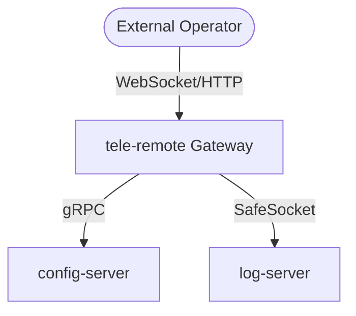

# 🗼 Architecture Overview: tele-remote

The **tele-remote** microservice serves as the edge gateway layer for external command propagation in the Bastien Ecosystem.

## 🔗 Context & Placement
*   **Tier**: `#tier/1-gateway` (Edge interface)
*   **Primary Technologies**: `#tech/go` (Golang Systems Engine)
*   **Central Integration**: Communicates with downstream microservices via gRPC and handles inbound web socket payloads.

## 📐 Structural Overview

